<p align="center">
  
</p>

<h1 align="center">زاد الخير</h1>

<p align="center">
  <b>شارك الخير، واصنع الفرق</b><br>
  منصة بتربط المطاعم والمتبرعين والمتطوعين بالمستفيدين، حتى ما يضيع أكل ولا غرض ممكن يفيد حدا.
</p>

<p align="center">
  Flutter · Firebase Auth · Cloud Firestore · Android · Windows · Web
</p>

---

## الفكرة

- **المطعم** بينشر الوجبات الزايدة عنده، والمستفيد بيحجز منها.
- **المستفيد** بيحجز وجبة أو بيطلب تبرع، وبياخد رمز استلام وQR Code.
- **المتبرع الفردي** بينشر تبرعات (أغذية، ملابس، كتب، أدوات…).
- **المتطوع** بياخد مهام توصيل من المطاعم والمتبرعين للجمعيات والمحتاجين، وبيتحقق من رموز الاستلام.

كل البيانات بتتحدث مباشرة (real-time) من Firestore، والحجز بيصير ضمن transaction حتى ما يحجز شخصين نفس الكمية بنفس اللحظة.

## لقطات الشاشة

### الدخول والتسجيل

<p>
  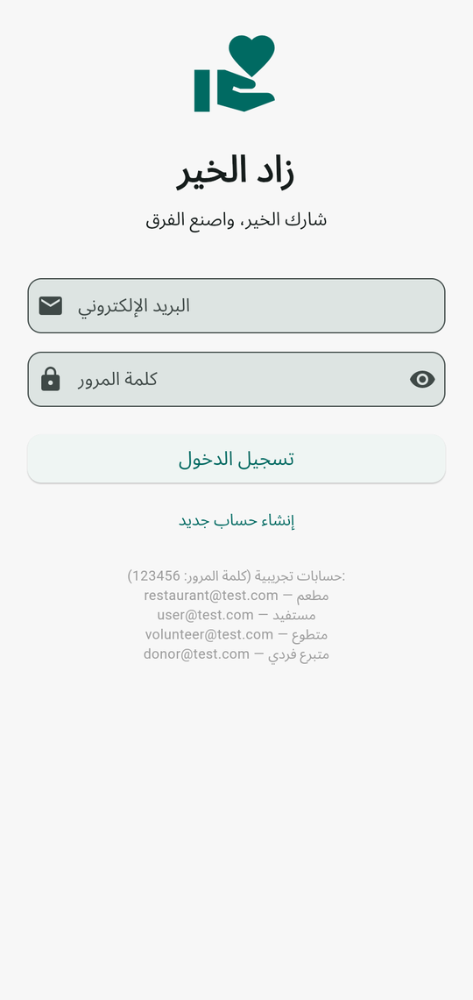
  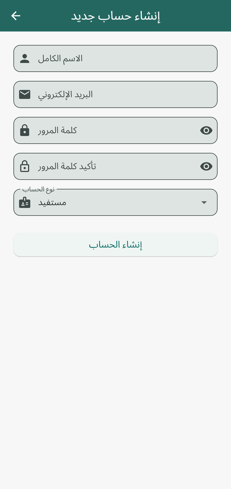
  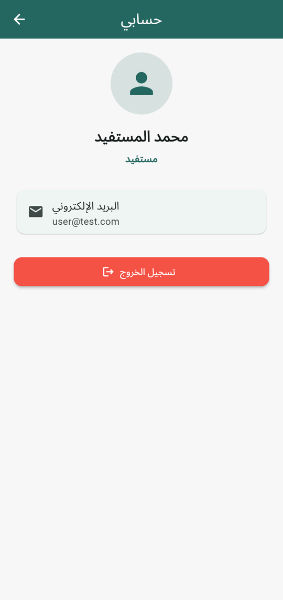
</p>

### المطعم

<p>
  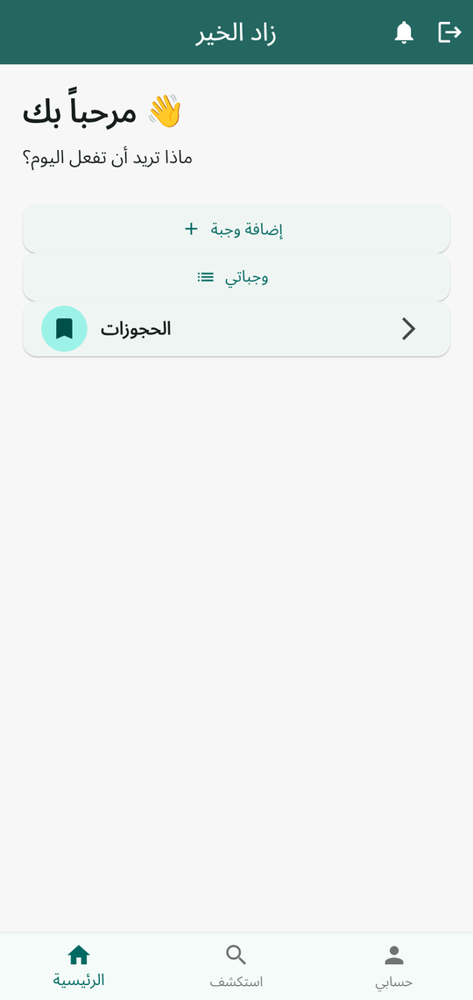
  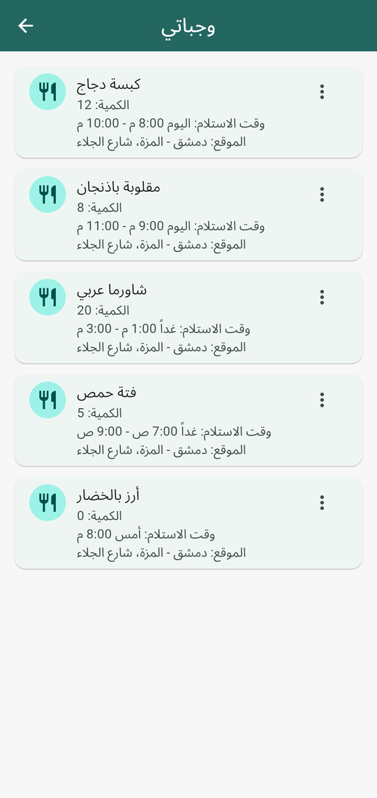
  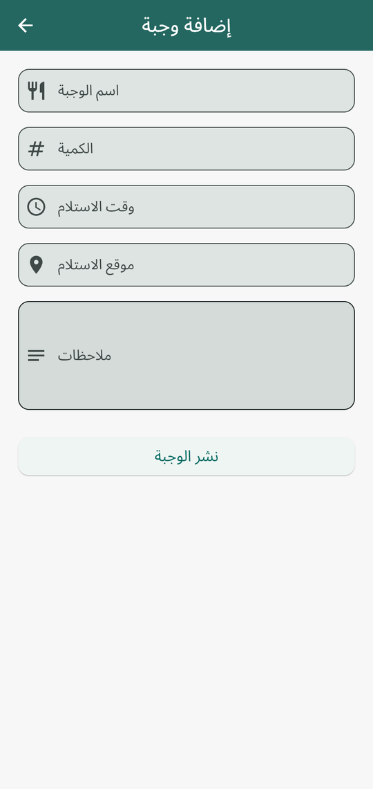
  
  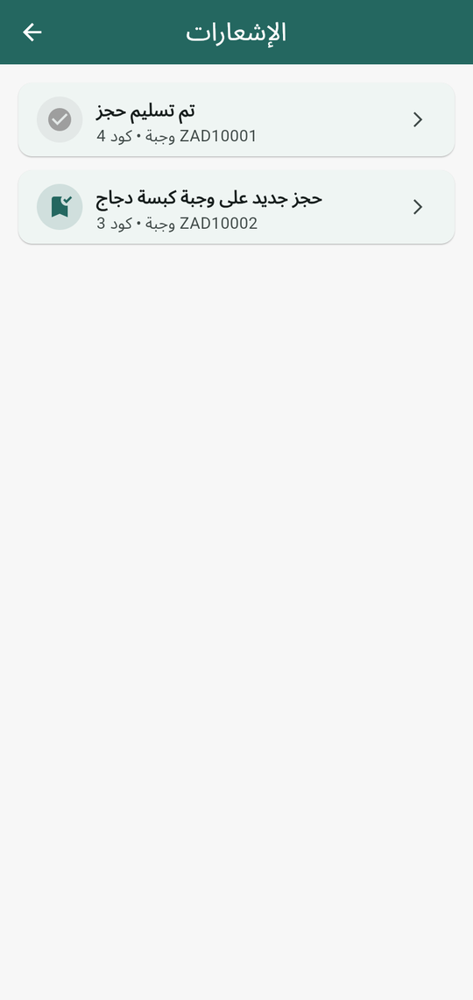
</p>

### المستفيد

<p>
  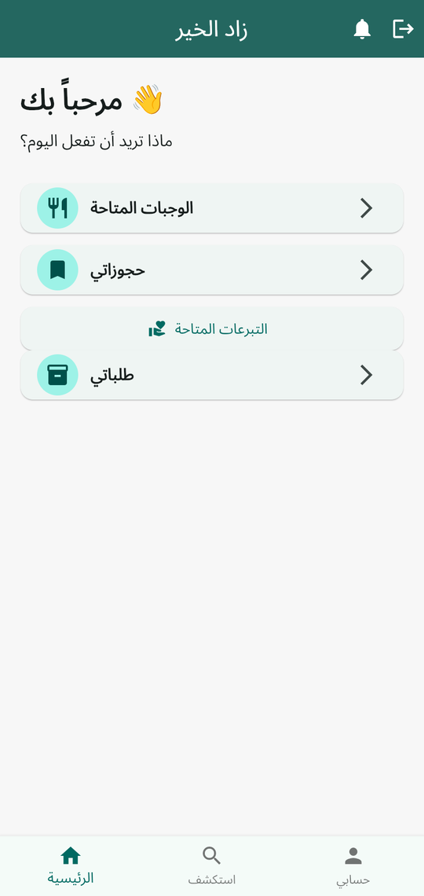
  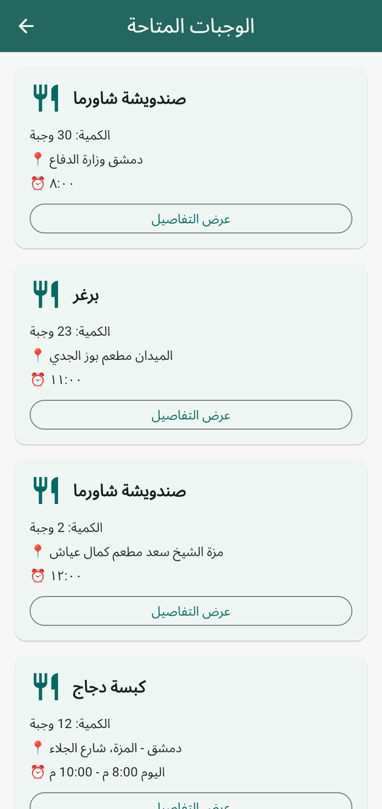
  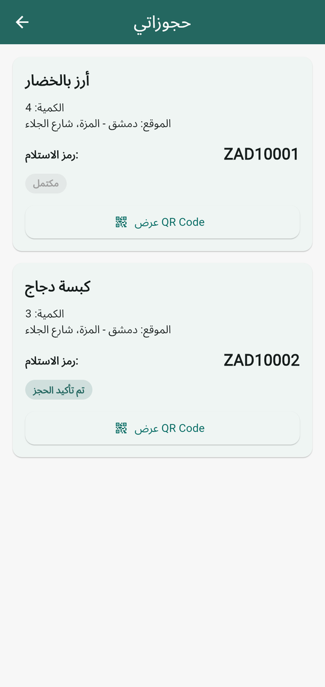
  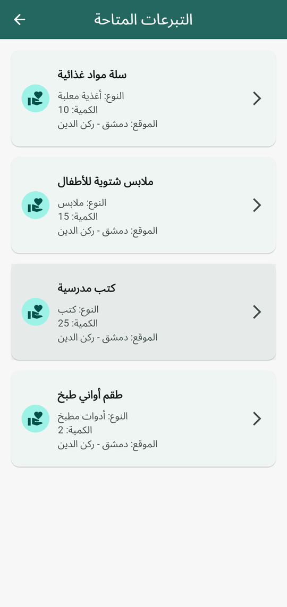
  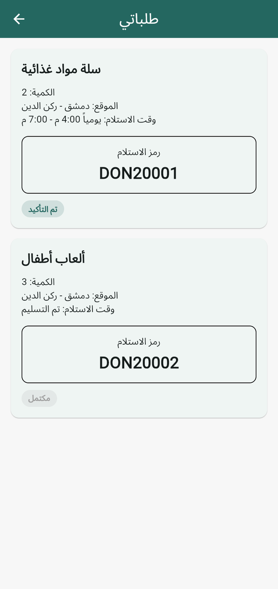
  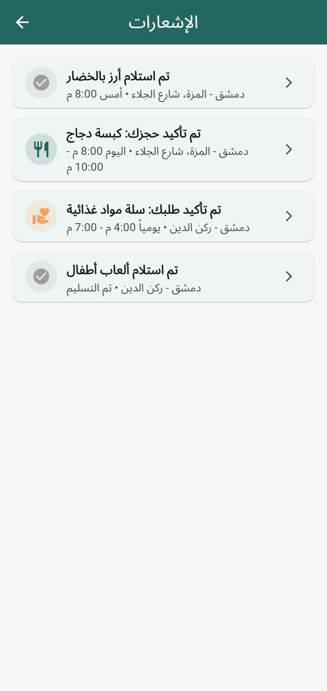
</p>

### المتبرع الفردي

<p>
  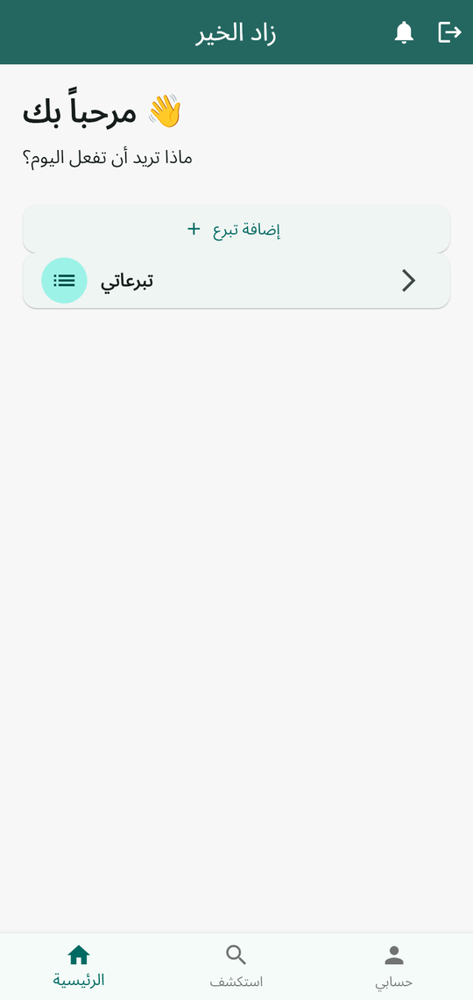
  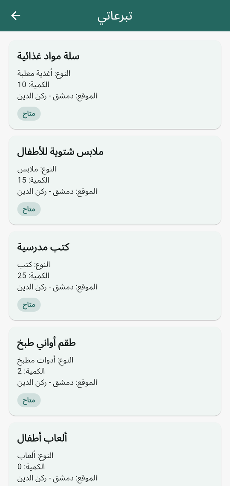
  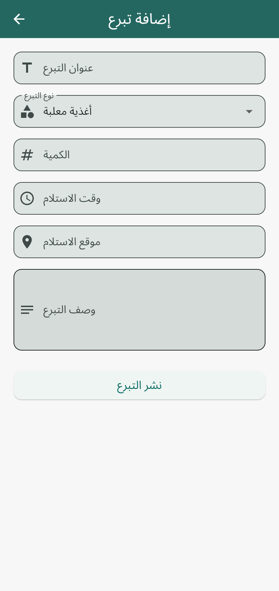
  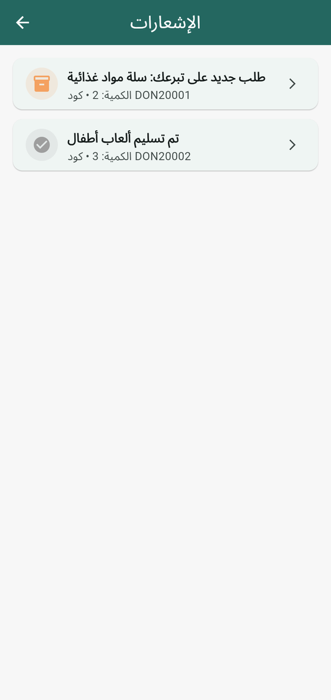
</p>

### المتطوع

<p>
  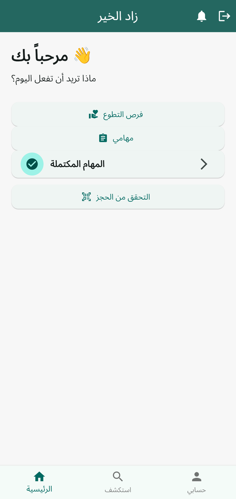
  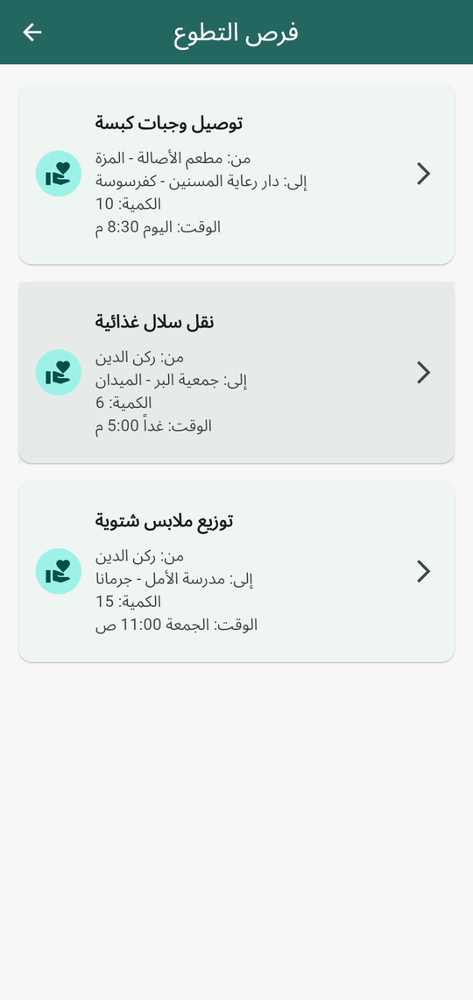
  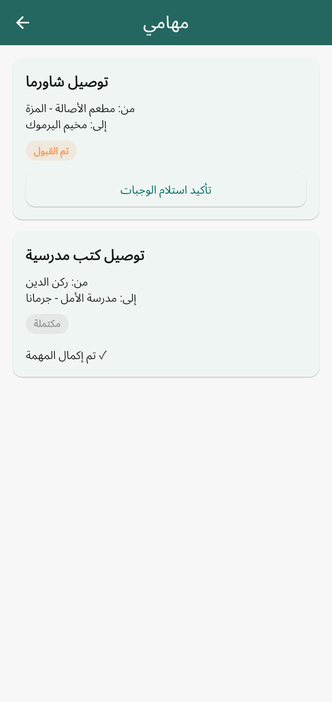
  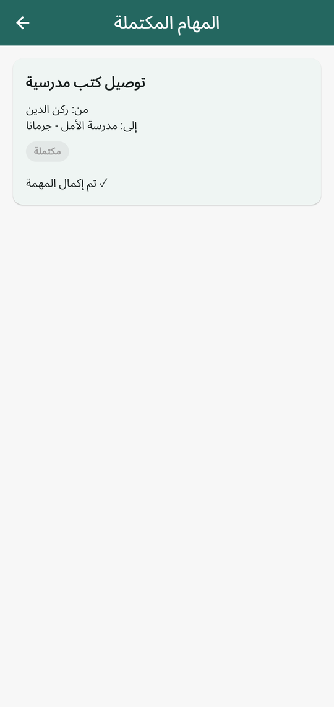
  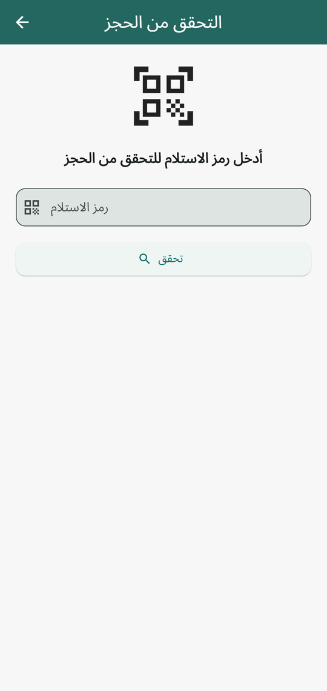
</p>

## حسابات تجريبية

كلمة المرور لكل الحسابات: `123456`

| الحساب | الدور |
|---|---|
| `restaurant@test.com` | مطعم |
| `user@test.com` | مستفيد |
| `donor@test.com` | متبرع فردي |
| `volunteer@test.com` | متطوع |

إذا قاعدة البيانات فاضية، شغّل التطبيق بوضع **debug** واضغط زر **«إضافة بيانات تجريبية»** بشاشة الدخول. بينشئ الحسابات الأربعة وبيعبّي وجبات وتبرعات وحجوزات ومهام ([seed_service.dart](lib/services/seed_service.dart)). المستندات إلها معرّفات ثابتة، فالضغط أكتر من مرة ما بيكرر البيانات.

## التشغيل

المتطلبات: Flutter 3.44 أو أحدث، ومشروع Firebase مفعّل فيه **Email/Password** بـ Authentication و **Cloud Firestore**.

```bash
flutter pub get
flutter run                 # أندرويد (جهاز أو محاكي)
flutter run -d chrome       # ويب
flutter run -d windows      # ويندوز
```

قواعد الأمان بـ [firestore.rules](firestore.rules)، ولرفعها:

```bash
firebase deploy --only firestore:rules
```

## بناء نسخ الإصدار (Release)

| المنصة | الأمر | الناتج |
|---|---|---|
| Android | `flutter build apk --release` | `build/app/outputs/flutter-apk/app-release.apk` |
| Windows | `flutter build windows --release` | `build/windows/x64/runner/Release/` (كل المجلد) |
| Web | `flutter build web --release` | `build/web/` |

### ملاحظات

- **Windows:** أول بناء بينزّل Firebase C++ SDK (حوالي 1 GB). إذا النت بيقطع، نزّل الملف يدوياً من
  `https://dl.google.com/firebase/sdk/cpp/firebase_cpp_sdk_windows_13.12.0.zip`
  وفكّه، وبعدين عرّف مساره:
  ```powershell
  setx FIREBASE_CPP_SDK_DIR "C:\path\to\firebase_cpp_sdk_windows"
  ```
  لتوزيع النسخة، انسخ مجلد `Release` كامل، مش بس ملف `zad_alkhair.exe`.
- **Windows:** مسح الـ QR بالكاميرا مش مدعوم على ويندوز، فزر «مسح QR» مخفي هناك. التحقق من الحجز بيصير بإدخال الرمز يدوياً.
- **Android:** نسخة الـ APK حالياً موقّعة بمفتاح الـ debug. قبل النشر على Google Play لازم تعمل مفتاح توقيع خاص ([الشرح الرسمي](https://docs.flutter.dev/deployment/android#sign-the-app)).
- **Web:** محتوى `build/web` بينرفع على أي استضافة ملفات ثابتة (Firebase Hosting، GitHub Pages…). لازم الدومين يكون مضاف بـ Firebase Console ← Authentication ← Settings ← Authorized domains.

## هيكلة المشروع

```
lib/
├── app/            # الثيم والمسارات (routes)
├── models/         # User, Meal, Reservation, Donation, DonationRequest, VolunteerTask
├── services/       # التعامل مع Firebase (Auth + Firestore) والبيانات التجريبية
├── screens/
│   ├── auth/           # الدخول والتسجيل
│   ├── home/           # الرئيسية حسب الدور
│   ├── meals/          # الوجبات (عرض، إضافة، تفاصيل)
│   ├── reservations/   # الحجوزات، QR، التحقق
│   ├── donations/      # التبرعات والطلبات
│   ├── volunteer/      # فرص التطوع والمهام
│   ├── notifications/  # الإشعارات
│   └── profile/        # حسابي
└── widgets/        # عناصر مشتركة
```

### مجموعات Firestore

| المجموعة | المحتوى |
|---|---|
| `users` | بيانات المستخدم ودوره |
| `meals` | وجبات المطاعم |
| `reservations` | حجوزات الوجبات ورموز الاستلام |
| `donations` | تبرعات الأفراد |
| `donationRequests` | طلبات المستفيدين على التبرعات |
| `volunteerTasks` | مهام التوصيل للمتطوعين |

## الأيقونة

الأيقونة (صحن وفوقه قلب، بألوان التطبيق) موجودة بـ [assets/icon/](assets/icon/). إذا غيّرتها، أعد توليد أيقونات كل المنصات بـ:

```bash
dart run flutter_launcher_icons
```
## لتحميل التطبيق: https://github.com/huzaifakhashan/my_restaurant_app/releases/tag/v1.0.0  
